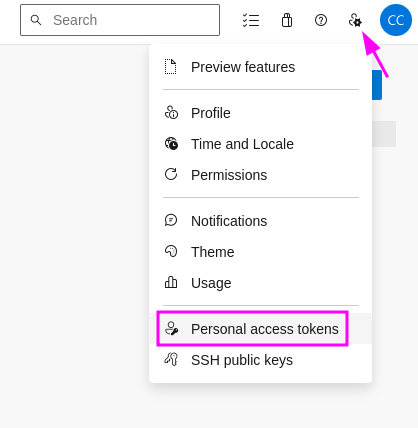

# 6. Integración Continua <!-- omit in toc -->

# 1. Crear cuenta en hub.docker.com

# 2. Construcción Manual
## 2.1. Clonar el código del proyecto
```
git clone https://github.com/cachac/public-api.git
rm -rf public-api/.git
cp -r public-api/. .
rm -rf public-api
```


## 2.2. Construir la imagen y ejecutar el contenedor
```
# Carga variables de entorno
source .env.qa
echo $APP_ENV_KUBE_API

docker build . -f qa.dockerfile -t <DOCKER USERNAME>/kubelabs_publicapi:1.0.0 --build-arg APP_ENV="$APP_ENV_KUBE_API"
docker run --rm --name api -p 3000:3000 <DOCKER USERNAME>/kubelabs_publicapi:1.0.0
```

## 2.3. Probar la aplicacción
```
# local
curl localhost:3000

# browser
<IP publica>:3000
```

## 2.4. Subir la imagen a Dockerhub

```
docker login

docker push <DOCKER USERNAME>/kubelabs_publicapi:1.0.0
```
## 2.5. Revisar la imagen en Dockerhub
## 2.6. Sincronizar cambios con main

# 3. Integración Continua
## 3.1. Crear cuenta Azure Devops
> [link](https://dev.azure.com/)
opcional: https://aex.dev.azure.com/

- Crear proyecto privado
- Nombre Demo

## 3.2. Analizar Boards
## 3.3. Analizar Repos
## 3.4. Crear Pipeline
- Conectar con Github
- Seleccionar el proyecto
- Crear azure-pipelines.yml

```yaml
trigger:
- main

resources:
- repo: self

variables:
  tag: '$(Build.BuildId)'
  imageName: 'public-api'

stages:
- stage: Build
  displayName: Build image
  jobs:
  - job: Build
    displayName: Build
    pool:
      vmImage: ubuntu-latest

    steps:
    - task: Docker@2
      displayName: Build an image
      inputs:
        repository: $(imageName)
        command: build
        dockerfile: '**/qa.dockerfile'
        tags: $(tag)

```

## 3.5. Error: No hosted parallelism has been purchased or granted. To request a free parallelism grant, please fill out the following form https://aka.ms/azpipelines-parallelism-request

### 3.5.1. Crear Agent Pool
- Ir al link del proyecto: ejemplo: https://dev.azure.com/cchacon0233
- Organization settings
- Agent Pools
- Add Pool
- self hosted
- New Agent
- Nombre: local-agent


### 3.5.2. Generar un PAT
- User settings
- PAT



- New Token
- agent-pool
- Full access


### 3.5.3. En la VM configurar el agente

#### 3.5.3.1. Buscar la versión del agente
- Ingresar al Agente: local-agent
- tab Agents
- New agent
- Seleccionar Linux
- Click en botón copiar


```
cd ~
curl -O <URL>
tar zxvf vsts-agent-linux-x64-<VERSION>.tar.gz

./config.sh

server URL: https://dev.azure.com/<my-organization-name>

PAT: xxxx

Enter agent pool name: local-agent
Enter agent name (VM name): <Enter>
Enter work folder: <Enter>
```

### 3.5.4. Ejecutar el agente
```
./run.sh
```

### 3.5.5. Revisar el agente en DevOps
- Tab Agents: Online
- Security: Pipeline permissions, agregar el pipeline.

### 3.5.6. Reconfigurar el yml

Eliminar el pool anterior y asignar el nuevo.
```yaml
pool: local-agent
```

### 3.5.7. Commit & Push

### 3.5.8. Revisar el pipeline
El pipeline termina correctamente y en el agente se visualiza el proceso.


En caso de error de permisos se debe asignar el pipeline.
> This pipeline needs permission to access a resource before this run can continue to Build image

### 3.5.9. Resultado
> Finishing: Build

> Job Build completed with result: Succeeded

### 3.5.10. Revisar logs en DevOps
- Click en el JOB Build
- Click en el step Build an Image

### 3.5.11. Revisar la imagen construida
En la VM local
```
docker images
```

# 4. Agregar variables de entorno

> Para este ejemplo el valor debe ser registrado con slash y comillas, ej: `\"APP_NAME\"`.

- Pipelines - Library
- Add Variable Group
- Name: CICD
- + Add:
  - Name: appVariable
  - Value: `"{ \"APP_NAME\":\"publicAPI\", \"NODE_ENV\":\"qa\", \"NODE_PORT\":\"3000\", \"TOKEN_LIMIT\":\"7d\", \"TOKEN_SECRET\":\"PASS\" }"`
- Change variable type to secret. (ícono de "lock")
- Guardar

## 4.1. Actualizar el yml agregando las variables.
```yaml
trigger:
  - main

resources:
  - repo: self

variables: <---------------------- AGREGA LAS VARIABLES
  - group: "CICD"
  - name: app_var
    value: $[variables.appVariable]
parameters:
  - name: tag
    default: "$(Build.BuildId)"
  - name: imageName
    default: "public-api"

stages:
  - stage: Build
    displayName: Build image
    jobs:
      - job: Build
        displayName: Build
        pool: local-agent

        steps:
          - script: |
              echo "var=$(app_var)"

          - task: Docker@2
            displayName: Build an image
            inputs:
              repository: ${{ parameters.imageName }}  <---------------------- AGREGA LAS VARIABLES
              command: build
              dockerfile: "**/qa.dockerfile"
              tags: ${{ parameters.tag }} <---------------------- AGREGA LAS VARIABLES
              arguments: '--build-arg APP_ENV="$(app_var)"'

```

# 5. Publicar al Registry: ACR
## 5.1. Crear
- search: container registries
- name acrapps
- create

## 5.2. Service Connection
En azure Devops:
- Project Settings
- Service connections - New service connection
- Type Docker Registry
- Check Azure Container Registry
- Authentication Type: Service Principal
- Subscription
- ACR
- Name: registryConnection
- Check Grant Access

## 5.3. Agregar el nuevo task al yml e integrar el registry de ACR
```yaml
trigger:
  - main

resources:
  - repo: self

variables:
  - group: "CICD"
  - name: app_var
    value: $[variables.appVariable]
parameters:
  - name: tag
    default: "$(Build.BuildId)"
  - name: imageName
    default: "public-api"

stages:
  - stage: Build
    displayName: Build image
    jobs:
      - job: Build
        displayName: Build
        pool: local-agent

        steps:
          - script: |
              echo "var=$(app_var)"
              echo "tag= ${{ parameters.tag }}"

          - task: Docker@2
            displayName: Build an image
            inputs:
              command: build
              repository: ${{ parameters.imageName }}
              dockerfile: "**/qa.dockerfile"
              tags: ${{ parameters.tag }}
              arguments: '--build-arg APP_ENV=$(app_var)' <------------------------------ build args
							containerRegistry: 'registryConnection' <------------------------------ repository service connection

          - task: Docker@2 <------------------------------ push task
            displayName: 'Push Docker Image'
            inputs:
              command: 'push'
              containerRegistry: 'registryConnection' <------------------------------ repository service connection
              repository: ${{ parameters.imageName }}
              tags: ${{ parameters.tag }}
```

## 5.4. Revisar el repo en ACR


## 5.5. Ejecutar manualmente el contenedor en la VM usando la imagen del ACR
> Cambiar el nombre del registry y el tag
```
docker images
docker run -p 3000:3000 --name public-api acrapps<NAME>.azurecr.io/public-api:<TAG>
```

# 6. Test browser
- <IP>:3000

# 7. Simular un cambio de versión en el package.json
```yaml
"version": "2.0.0",
```
# 8. Fusionar cambios y probar en browser

# 9. Opcional. Instalar y configurar ACR en la VM
```
curl -sL https://aka.ms/InstallAzureCLIDeb | sudo bash

# Azure Entra Login
az login --use-device-code

# Azure ACR login
az acr login --name acrappscarlos
```
