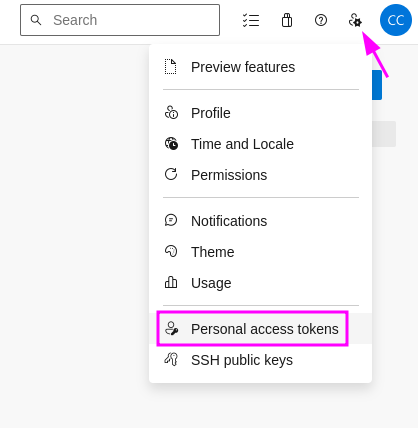

# 6. Integración Continua <!-- omit in toc -->

# 1. Crear cuenta en hub.docker.com

# 2. Construcción Manual
## 2.1. Clonar el código del proyecto
```
git clone https://github.com/cachac/public-api.git
rm -rf public-api/.git
cp -r public-api/. .
rm -rf public-api
```


## 2.2. Construir la imagen y ejecutar el contenedor
```
# Carga variables de entorno
source .env.qa
echo $APP_ENV_KUBE_API

docker build . -f qa.dockerfile -t <DOCKER USERNAME>/kubelabs_publicapi:1.0.0 --build-arg APP_ENV="$APP_ENV_KUBE_API"
docker run --rm --name api -p 3000:3000 <DOCKER USERNAME>/kubelabs_publicapi:1.0.0
```

## 2.3. Probar la aplicacción
```
# local
curl localhost:3000

# browser
<IP publica>:3000
```

## 2.4. Subir la imagen a Dockerhub

```
docker login

docker push <DOCKER USERNAME>/kubelabs_publicapi:1.0.0
```
## 2.5. Revisar la imagen en Dockerhub
## 2.6. Sincronizar cambios con main

# 3. Integración Continua
## 3.1. Crear cuenta Azure Devops
> [link](https://dev.azure.com/)

## 3.2. Analizar Boards
## 3.3. Analizar Repos
## 3.4. Crear Pipeline
- Conectar con Github
- Seleccionar el proyecto
- Crear azure-pipelines.yml

```yaml
trigger:
- main

resources:
- repo: self

variables:
  tag: '$(Build.BuildId)'
  imageName: 'public-api'

stages:
- stage: Build
  displayName: Build image
  jobs:
  - job: Build
    displayName: Build
    pool:
      vmImage: $(vmImageName)

    steps:
    - task: Docker@2
      displayName: Build an image
      inputs:
        repository: $(imageName)
        command: build
        dockerfile: '**/qa.dockerfile'
        tags: |
          $(tag)

```

## 3.5. Error: No hosted parallelism has been purchased or granted. To request a free parallelism grant, please fill out the following form https://aka.ms/azpipelines-parallelism-request

- link ejemplo: https://dev.azure.com/cchacon0233/
- Organization settings
- Agent Pools
- Add Pool
- selft hosted
- New Agent
- Nombre: local-agent


### 3.5.1. Generar un PAT
- User settings
- PAT



- New Token
- agent-pool
- Full access


### 3.5.2. En la VM configurar el agente
```
cd ~
curl -O https://vstsagentpackage.azureedge.net/agent/3.241.0/vsts-agent-linux-x64-3.241.0.tar.gz
tar zxvf vsts-agent-linux-x64-3.241.0.tar.gz

./config.sh

server URL: https://dev.azure.com/<my-organization-name>

PAT: xxxx
```

### 3.5.3. Ejecutar el agente
```
./run.sh
```

### 3.5.4. Reconfigurar el yml
```yaml
pool: local-agent
```

### 3.5.5. Commit & Push

### 3.5.6. Revisar el pipeline
> This pipeline needs permission to access a resource before this run can continue to Build image

### 3.5.7. Resultado
> Finishing: Build

> Job Build completed with result: Succeeded


# 4. Agregar variables de entorno
- Pipelines - Library
- Add group
- CICD
- Name: appVariable
- Value: "{ \"APP_NAME\":\"publicAPI\", \"NODE_ENV\":\"qa\", \"NODE_PORT\":\"3000\", \"TOKEN_LIMIT\":\"7d\", \"TOKEN_SECRET\":\"PASS\" }"
- Change variable type to secret
- Save

## 4.1. Actualizar el yml
```yaml
trigger:
  - main

resources:
  - repo: self

variables:
  - group: "CICD"
  - name: app_var
    value: $[variables.appVariable]
parameters:
  - name: tag
    default: "$(Build.BuildId)"
  - name: imageName
    default: "public-api"

stages:
  - stage: Build
    displayName: Build image
    jobs:
      - job: Build
        displayName: Build
        pool: test

        steps:
          - script: |
              echo "var=$(app_var)"

          - task: Docker@2
            displayName: Build an image
            inputs:
              repository: ${{ parameters.imageName }}
              command: build
              dockerfile: "**/qa.dockerfile"
              tags: ${{ parameters.tag }}
              arguments: '--build-arg APP_ENV=$(app_var)'

```

# 5. Publicar al Registry: ACR
## 5.1. Crear
- search: container registries
- name acrapps
- create

## 5.2. Service Connection
- Settings
- Service connections - New
- Type Docker Registry
- Check Azure Container Registry
- Authentication Type: Service Principal
- Subscription
- ACR
- Name: registryConnection
- Check Grant Access

## 5.3. Agregar el nuevo task al yml
```yaml
trigger:
  - main

resources:
  - repo: self

variables:
  - group: "CICD"
  - name: app_var
    value: $[variables.appVariable]
parameters:
  - name: tag
    default: "$(Build.BuildId)"
  - name: imageName
    default: "public-api"

stages:
  - stage: Build
    displayName: Build image
    jobs:
      - job: Build
        displayName: Build
        pool: test

        steps:
          - script: |
              echo "var=$(app_var)"
              echo "tag= ${{ parameters.tag }}"

          - task: Docker@2
            displayName: Build an image
            inputs:
              command: build
              containerRegistry: 'registryConnection'                         <------------------------------ repository service connection
              repository: ${{ parameters.imageName }}
              dockerfile: "**/qa.dockerfile"
              tags: |
                ${{ parameters.tag }}
              arguments: '--build-arg APP_ENV=$(app_var)'

          - task: Docker@2                                                    <------------------------------ push task
            displayName: 'Push Docker Image'
            inputs:
              command: 'push'
              containerRegistry: 'registryConnection'
              repository: ${{ parameters.imageName }}
              tags: |
                ${{ parameters.tag }}
```

## 5.4. Revisar el repo en ACR


## 5.5. Ejecutar manualmente el contenedor en la VM
```
docker images
docker run -p 3000:3000 --name public-api acrapps.azurecr.io/public-api:<TAG>
```

# 6. Test browser
- <IP>:3000

# 7. Simular un cambio de versión en el package.json
```yaml
"version": "2.0.0",
```
# 8. Fusionar cambios y probar en browser
